# Diagrama de clases del dominio

La app tiene cuatro bounded contexts que comparten un informe PDF: ordenamiento con árboles (AOA), planificación de procesos (APPSO), arreglos RAID (ARD) y tabla de direccionamiento (TDR).

Cada catálogo (`Algorithm`, `SchedulerAlgorithm`, `RaidAlgorithm`, `AddressingAlgorithm`) define un algoritmo y produce una secuencia de frames (`SimFrame`, `SchedFrame`, `RaidFrame`, `AddressFrame`). Esos snapshots alimentan el `SimulationReport` compartido.

```mermaid
classDiagram
direction TB

namespace Catalogos {
  class Algorithm {
    +string slug
    +string name
    +string treeType
    +string summary
    +string description
    +string[] howItWorks
    +AlgorithmComplexity complexity
    +boolean stable
    +boolean inPlace
    +string pseudocode
    +string example
  }
  class AlgorithmComplexity {
    +string best
    +string average
    +string worst
    +string space
  }
  class SchedulerAlgorithm {
    +string slug
    +string name
    +string family
    +string summary
    +string description
    +string[] howItWorks
    +SchedulerComplexity complexity
    +boolean preemptive
    +boolean usesPriority
    +boolean usesQuantum
    +number defaultQuantum
    +string pseudocode
    +string example
  }
  class SchedulerComplexity {
    +string criterion
    +string kind
    +string starvation
    +string selection
  }
  class RaidAlgorithm {
    +string slug
    +string name
    +string family
    +string summary
    +string description
    +string[] howItWorks
    +RaidTraits traits
    +number minDisks
    +number maxDisks
    +number defaultDisks
    +boolean evenDisks
    +string pseudocode
    +string example
  }
  class RaidTraits {
    +string usable
    +string faultTolerance
    +string kind
    +string access
  }
  class AddressingAlgorithm {
    +string slug
    +string name
    +string family
    +string summary
    +string description
    +string[] howItWorks
    +AddressingTraits traits
    +string pseudocode
    +string example
  }
  class AddressingTraits {
    +string maskKind
    +string allocation
    +string waste
    +string order
  }
}

namespace Ordenamiento {
  class SimEngine {
    <<interface>>
    +string slug
    +run(input: number[]) SimFrame[]
  }
  class SimFrame {
    +string message
    +number[] array
    +number[] output
    +number[] highlightedIndexes
    +number[] lockedIndexes
    +VizNode[] nodes
    +string[] rootIds
    +boolean done
  }
  class VizNode {
    +string id
    +number[] keys
    +string[] childrenIds
    +NodeColor color
    +boolean highlight
    +boolean faded
    +string label
  }
  class BinNode {
    +number value
    +string id
    +BinNode left
    +BinNode right
    +BinNode parent
    +NodeColor color
    +number height
    +boolean faded
  }
  class NodeColor {
    <<enumeration>>
    red
    black
    none
  }
}

namespace Planificacion {
  class SimProcess {
    +string id
    +number arrival
    +number burst
    +number priority
  }
  class ProcessView {
    +string id
    +number arrival
    +number burst
    +number remaining
    +number priority
    +number queue
    +number startTime
    +number finishTime
    +number waiting
    +number turnaround
    +number response
    +ProcessStatus status
  }
  class ProcessStatus {
    <<enumeration>>
    new
    ready
    running
    done
  }
  class GanttSlice {
    +string processId
    +number start
    +number end
  }
  class SchedFrame {
    +number time
    +string message
    +string running
    +string[] ready
    +ProcessView[] processes
    +GanttSlice[] gantt
    +boolean done
  }
}

namespace RAID {
  class RaidFrame {
    +string message
    +RaidDiskView[] disks
    +RaidCell[] cells
    +number rows
    +number failedDisk
    +boolean done
  }
  class RaidDiskView {
    +number index
    +string name
    +boolean failed
    +string role
  }
  class RaidCell {
    +number disk
    +number row
    +string label
    +CellKind kind
    +boolean highlight
    +boolean reconstructed
  }
  class CellKind {
    <<enumeration>>
    data
    parity
    mirror
    hamming
    empty
  }
}

namespace Direccionamiento {
  class AddressPlanInput {
    +string gateway
    +number lanCount
    +number manCount
    +number wanCount
    +number lanHosts
    +number manHosts
    +number wanHosts
  }
  class ParentNetwork {
    +string gateway
    +string network
    +string broadcast
    +string mask
    +number prefix
    +string className
    +number addressCount
  }
  class PlannedNetwork {
    +string name
    +NetworkKind kind
    +string network
    +string firstHost
    +string lastHost
    +string broadcast
    +string mask
    +number prefix
    +number usableHosts
    +number requestedHosts
  }
  class AddressFrame {
    +string message
    +ParentNetwork parent
    +PlannedNetwork[] networks
    +string highlightName
    +number unused
    +boolean done
  }
  class NetworkKind {
    <<enumeration>>
    LAN
    MAN
    WAN
  }
}

namespace Reportes {
  class SimulationReport {
    +string catalog
    +string algorithm
    +string filename
    +string[] inputLines
    +string[] resultLines
    +ReportTable resultTable
    +string[] conclusion
  }
  class ReportTable {
    +string[] headers
    +string[][] rows
  }
}

Algorithm *-- AlgorithmComplexity : complexity
SchedulerAlgorithm *-- SchedulerComplexity : complexity
RaidAlgorithm *-- RaidTraits : traits
AddressingAlgorithm *-- AddressingTraits : traits

Algorithm ..> SimEngine : slug
SimEngine --> SimFrame : run
SimFrame *-- VizNode : nodes
VizNode --> NodeColor
VizNode --> VizNode : childrenIds
BinNode --> NodeColor
BinNode --> BinNode : left
BinNode --> BinNode : right
BinNode --> BinNode : parent
BinNode ..> VizNode : flattenBinary

SimProcess ..> ProcessView : proyección
ProcessView --> ProcessStatus
SchedFrame *-- ProcessView : processes
SchedFrame *-- GanttSlice : gantt
GanttSlice ..> ProcessView : processId

RaidFrame *-- RaidDiskView : disks
RaidFrame *-- RaidCell : cells
RaidCell --> CellKind

AddressPlanInput ..> ParentNetwork : red del gateway
AddressPlanInput ..> PlannedNetwork : LAN MAN WAN
PlannedNetwork --> NetworkKind
AddressFrame *-- ParentNetwork : parent
AddressFrame *-- PlannedNetwork : networks
AddressingAlgorithm ..> AddressFrame : simulateAddressing

Algorithm ..> SimulationReport : buildSortReport
SchedulerAlgorithm ..> SimulationReport : buildScheduleReport
RaidAlgorithm ..> SimulationReport : buildRaidReport
AddressingAlgorithm ..> SimulationReport : buildAddressReport
SimulationReport o-- ReportTable : resultTable
```

